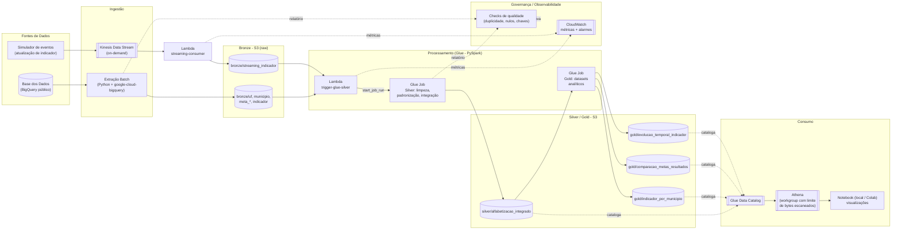

# Pipeline Híbrido para Análise da Alfabetização no Brasil

Tech Challenge – Fase 2 (Pós Tech / IAST). Pipeline de dados híbrida (batch + streaming),
em Arquitetura Medalhão (Bronze/Silver/Gold), rodando na **AWS**, alimentada por dados
públicos da **Base dos Dados** (BigQuery), sobre o **Indicador Criança Alfabetizada**.

## Sumário

- [Contexto do problema](#contexto-do-problema)
- [O indicador e o desafio educacional](#o-indicador-e-o-desafio-educacional)
- [Arquitetura da solução](#arquitetura-da-solução)
- [Fluxo de dados](#fluxo-de-dados)
- [Tecnologias utilizadas e justificativa](#tecnologias-utilizadas-e-justificativa)
- [Decisões arquiteturais (trade-offs)](#decisões-arquiteturais-trade-offs)
- [Regras de qualidade de dados](#regras-de-qualidade-de-dados)
- [Monitoramento](#monitoramento)
- [FinOps – otimização de custos](#finops--otimização-de-custos)
- [Aplicação em IA](#aplicação-em-ia)
- [Estrutura do repositório](#estrutura-do-repositório)
- [Passo a passo de setup](#passo-a-passo-de-setup)
- [Como rodar](#como-rodar)
- [Vídeo executivo](#vídeo-executivo)

## Contexto do problema

A alfabetização na infância é um dos pilares do desenvolvimento educacional, social e
econômico do país. O **Compromisso Nacional Criança Alfabetizada** mobiliza União, estados,
Distrito Federal e municípios para garantir que todas as crianças brasileiras estejam
alfabetizadas até o final do 2º ano do ensino fundamental, com meta nacional para 2030.

Para apoiar essa política, o INEP realizou em 2023 a Pesquisa Alfabetiza Brasil e definiu o
ponto de corte de **743 pontos** na escala de proficiência do Saeb como o nível a partir do
qual uma criança é considerada alfabetizada. A partir disso foi criado o **Indicador Criança
Alfabetizada**: o percentual de estudantes que atingem esse patamar.

Entender os fatores que influenciam a alfabetização exige integrar fontes heterogêneas —
metas nacionais/estaduais/municipais, dados territoriais, microdados educacionais e
indicadores de desempenho — o que é exatamente o problema de engenharia de dados que esta
pipeline resolve.

## O indicador e o desafio educacional

Este projeto atua como um time de engenharia de dados de uma organização pública de análise
educacional, integrando as seguintes entidades da plataforma **Base dos Dados**:

| Entidade | Papel na pipeline |
|---|---|
| UF | Dimensão territorial (estado) |
| Município | Dimensão territorial (município, chave `id_municipio`) |
| Meta Alfabetização Brasil | Meta nacional por ano |
| Meta Alfabetização por UF | Meta estadual por ano |
| Meta Alfabetização por Município | Meta municipal por ano |
| Dados de alunos / indicador | Resultado realizado do indicador por município/ano |

A integração dessas fontes permite comparar **meta vs. resultado realizado** em qualquer
nível geográfico e acompanhar a evolução temporal rumo à meta de 2030.

## Arquitetura da solução



**Camadas (Arquitetura Medalhão):**

- **Bronze** — dados brutos, sem transformação, histórico completo preservado. Recebe tanto
  a ingestão batch (extração diária/periódica do BigQuery) quanto a streaming (eventos
  simulados de atualização de indicador via Kinesis).
- **Silver** — dados limpos, tipados, com chaves normalizadas (ex.: `id_municipio` com 7
  dígitos) e **integrados** entre si (município + UF + metas + indicador).
- **Gold** — datasets analíticos prontos para consumo: indicador por município, comparação
  meta vs. resultado, e evolução temporal — preparados para dashboards, análises estatísticas
  e treinamento de modelos de ML.

## Fluxo de dados

1. **Batch**: `src/bronze/extract_batch_bigquery.py` consulta as tabelas da Base dos Dados no
   BigQuery e grava Parquet particionado em `s3://bucket/bronze/<entidade>/dt_ingestao=.../`.
2. **Streaming (simulado)**: `src/bronze/streaming_producer.py` gera eventos sintéticos de
   "atualização de indicador" e envia ao Kinesis; a Lambda `streaming-consumer` os grava em
   `bronze/streaming_indicador/dt=.../hh=.../`.
3. Toda vez que um objeto novo chega em `bronze/`, o evento `S3:ObjectCreated` aciona a Lambda
   `trigger-glue-silver`, que dispara o **Glue Job Silver** (com debounce para não duplicar
   execuções concorrentes).
4. O **Glue Job Silver** lê todas as entidades Bronze, limpa, padroniza tipos/nomes, trata
   nulos e duplicidade, normaliza chaves e integra tudo em `silver/alfabetizacao_integrado`,
   catalogando automaticamente no Glue Data Catalog.
5. O **Glue Job Gold** lê a Silver integrada e produz os 3 datasets analíticos em `gold/`.
6. **Athena** consulta os dados Gold direto do catálogo (sem mover dados), com um workgroup
   configurado com limite de bytes escaneados por query.
7. O **notebook** (`notebooks/pipeline_alfabetizacao.ipynb`, roda local ou no Colab) orquestra
   os passos acima manualmente para fins de demonstração/aula, consulta o Athena e plota os
   gráficos.
8. Checks de **qualidade de dados** (`src/quality/data_quality_checks.py`) rodam na fronteira
   Bronze→Silver e gravam relatórios JSON em `governance/quality-reports/` no S3.

## Tecnologias utilizadas e justificativa

| Tecnologia | Por quê |
|---|---|
| **Amazon S3** | Data lake único, barato, com lifecycle automático (FinOps) e formato Parquet colunar. |
| **AWS Glue (PySpark)** | ETL serverless, escala automaticamente, sem cluster para gerenciar; paga por DPU-hora usada. Escolhido em vez de EMR (custo/gestão) para o volume deste dataset. |
| **AWS Lambda** | Orquestração leve orientada a evento (S3 → Silver) e consumo do streaming — sem servidor ocioso. |
| **Amazon Kinesis Data Streams (on-demand)** | Simula ingestão quase em tempo real com custo proporcional ao uso, sem provisionar shards fixos. |
| **AWS Glue Data Catalog + Athena** | Camada analítica "sem servidor": consulta SQL direto no S3, sem duplicar dados em um data warehouse. |
| **CloudWatch** | Métricas e alarmes nativos de Lambda/Glue, sem ferramenta extra de observabilidade. |
| **Google BigQuery (dataset público `basedosdados`)** | Fonte oficial dos dados do desafio; consulta sem custo de armazenamento, só o billing project paga pelos bytes escaneados. |
| **Python (boto3, pandas, google-cloud-bigquery)** | Linguagem única em toda a pipeline (extração, IaC, notebook, Lambdas), reduzindo a curva de aprendizado da equipe. |

## Decisões arquiteturais (trade-offs)

- **Batch vs. streaming**: as fontes oficiais (metas, indicador) são publicadas em lote,
  então batch é o modo natural para elas. Streaming foi implementado como uma **simulação**
  de eventos de atualização (não existe um endpoint de eventos real da Base dos Dados), para
  demonstrar o padrão de ingestão híbrida pedido no desafio, sem inventar uma fonte externa
  fictícia.
- **Data lake vs. data warehouse**: optamos por data lake (S3 + Parquet + Glue Catalog +
  Athena) em vez de um data warehouse gerenciado (ex.: Redshift). Para o volume de dados do
  desafio (dezenas de MB a poucos GB), um DW dedicado teria custo fixo maior sem ganho de
  performance relevante; Athena paga só por bytes escaneados.
- **Custo vs. performance**: Glue jobs com `WorkerType=G.1X` e apenas 2 workers (menor
  configuração prática), *job bookmarks* habilitados (processa só dado novo) e Parquet
  particionado (menos I/O e menos bytes escaneados no Athena). Isso sacrifica velocidade de
  processamento em favor de custo — aceitável porque o pipeline não é latência-crítica.

## Regras de qualidade de dados

Implementadas em `src/quality/data_quality_checks.py` e chamadas tanto na extração Bronze
quanto dentro dos jobs Glue:

- **Duplicidade**: linhas totalmente duplicadas e duplicidade por chave de negócio.
- **Valores ausentes**: contagem e percentual de nulos por coluna, com limite configurável
  (alerta se uma coluna passa de 30% de nulos).
- **Validação de chaves**: linhas com chave nula são reportadas antes de serem descartadas na
  camada Silver.
- **Consistência entre tabelas**: `check_referential_integrity()` confere se toda chave
  estrangeira (ex.: `id_municipio` nos dados de alunos) existe na tabela dimensão
  correspondente (`municipio`), reportando órfãos.

Cada execução grava um relatório JSON versionado em
`s3://bucket/governance/quality-reports/<camada>/<entidade>/dt_ingestao=.../report.json`,
dando rastreabilidade/auditoria (governança).

## Monitoramento

- **CloudWatch Metrics customizadas**: a Lambda `streaming-consumer` publica
  `StreamingEventsProcessed` e `StreamingDecodeErrors` a cada invocação (volume processado e
  falhas de ingestão).
- **CloudWatch Alarms**: um alarme por função Lambda na métrica nativa `Errors` (falhas de
  ingestão/orquestração).
- **Glue job metrics + continuous logging**: habilitados via `--enable-metrics` e
  `--enable-continuous-cloudwatch-log` em cada job (latência e progresso do pipeline visíveis
  no CloudWatch sem instrumentação extra).
- **Relatórios de qualidade** (acima) funcionam como monitoramento de governança/consistência.

## FinOps – otimização de custos

- **Armazenamento eficiente**: Parquet colunar + particionamento por `dt_ingestao`/`ano`/
  `sigla_uf` em todas as camadas — menos bytes lidos em cada consulta Glue/Athena.
- **Lifecycle no S3**: dados Bronze migram para `STANDARD_IA` após 30 dias e `GLACIER` após
  90 dias; resultados do Athena (efêmeros) expiram em 7 dias; versões antigas expiram em 30
  dias.
- **Athena workgroup com `BytesScannedCutoffPerQuery=1GB`**: evita custo acidental de uma
  query sem filtro/partição.
- **Glue jobs pequenos e orientados a evento**: `G.1X` / 2 workers, *job bookmarks* (só
  processa dado novo), disparo por evento S3 em vez de agendamento fixo — o job não roda
  quando não há dado novo.
- **Kinesis on-demand**: sem shards provisionados ociosos.
- **Lambda com memória mínima prática (256MB)** e pacote de deploy enxuto (sem dependências
  pesadas no consumer de streaming).
- **Estimativa de custo** (uso esporádico, cenário de disciplina/demo, região `sa-east-1`):
  S3 (poucos GB) ≈ US$ 0,05–0,20/mês; Glue (poucos minutos por execução, G.1X x2) ≈ US$
  0,01–0,05 por execução; Athena (queries pequenas, particionadas) ≈ centavos por query;
  Kinesis on-demand + Lambda ≈ centavos por sessão de demonstração. **Recomendação**: rode
  `infra/teardown_aws.py --yes` depois de gravar o vídeo/terminar a avaliação para zerar o
  custo.

## Aplicação em IA

A camada **Gold** foi desenhada para alimentar diretamente:

- **Modelos preditivos de alfabetização por município**: `gold_indicador_por_municipio`
  combinado com features territoriais/socioeconômicas (fonte externa opcional, ver seção
  abaixo) pode treinar um modelo de regressão/classificação para prever se um município vai
  atingir a meta.
- **Análise de desigualdade educacional**: `gold_comparacao_metas_resultados` (coluna
  `gap_percentual`) permite clusterizar municípios por vulnerabilidade educacional (ex.:
  k-means sobre o gap + indicadores socioeconômicos).
- **Políticas públicas baseadas em dados**: `gold_evolucao_temporal_indicador` alimenta
  modelos de série temporal (ARIMA/Prophet) para estimar a trajetória até a meta nacional de
  2030 por UF, priorizando onde investir.

### Fontes externas opcionais (enriquecimento)

Não implementadas nesta entrega inicial, mas o pipeline já está preparado (camada Silver
integra por `id_municipio`/`sigla_uf`) para incorporar: Censo Escolar (INEP), Censo/PNAD
(IBGE), Atlas do Desenvolvimento Humano, Cadastro Único/Bolsa Família, território (IBGE) e
FUNDEB.

## Estrutura do repositório

```
.
├── README.md
├── requirements.txt
├── notebooks/
│   └── pipeline_alfabetizacao.ipynb   # orquestra tudo, roda local ou no Colab
├── src/
│   ├── config.py                      # config central (bucket, região, tabelas de origem)
│   ├── bronze/
│   │   ├── extract_batch_bigquery.py  # ingestão batch (BigQuery -> S3 bronze)
│   │   └── streaming_producer.py      # simula eventos -> Kinesis
│   ├── silver/glue_silver_job.py      # Glue job: limpeza, padronização, integração
│   ├── gold/glue_gold_job.py          # Glue job: datasets analíticos
│   ├── quality/data_quality_checks.py # duplicidade, nulos, chaves, integridade referencial
│   └── lambda/
│       ├── streaming_consumer/handler.py  # Kinesis -> S3 bronze
│       └── trigger_glue/handler.py        # S3 -> dispara Glue Silver
├── infra/
│   ├── provision_aws.py               # IaC (boto3), idempotente
│   ├── teardown_aws.py                # desmonta tudo (FinOps)
│   └── iam_policies/*.json            # trust/permission policies (Glue e Lambda)
└── docs/                              # material de apoio (opcional)
```

## Passo a passo de setup

### 1. Criar o usuário IAM na AWS (você precisa fazer isso manualmente)

1. Acesse o **AWS Console** → **IAM** → **Users** → **Create user**.
2. Nome: `extrator-datalake` (ou o nome que preferir). **Não** marque acesso ao Console — só
   precisamos de *programmatic access*.
3. Em "Set permissions", escolha **Attach policies directly** e, para simplificar o setup do
   desafio, anexe as políticas gerenciadas: `AmazonS3FullAccess`, `AWSGlueConsoleFullAccess`,
   `AWSLambda_FullAccess`, `AmazonKinesisFullAccess`, `AmazonAthenaFullAccess`,
   `CloudWatchFullAccess`, `IAMFullAccess` (necessário porque o script cria as roles do Glue
   e da Lambda).
   - *Alternativa mais restrita (recomendada depois que tudo estiver funcionando)*: crie uma
     policy customizada com só as ações usadas em `infra/iam_policies/*.json` + `iam:CreateRole`,
     `iam:PutRolePolicy`, `iam:AttachRolePolicy`, `iam:GetRole`, escopadas ao seu bucket/conta.
4. Finalize a criação e **na tela de sucesso** (ou em Users → extrator-datalake → Security
   credentials → Create access key → "Application running outside AWS") copie o **Access Key
   ID** e o **Secret Access Key**. A secret key só aparece uma vez — guarde com cuidado.
5. No seu terminal (local, fora do Claude Code — nunca cole chaves em uma sessão de agente):
   ```bash
   aws configure
   ```
   Informe o Access Key ID, o Secret Access Key e a região `sa-east-1` (ou a que preferir,
   ajustando `AWS_REGION` em `src/config.py`).
6. Confirme que funcionou:
   ```bash
   aws sts get-caller-identity
   ```
   Deve retornar seu `Account`, `UserId` e `Arn` sem erro.

### 2. Acesso ao BigQuery (Base dos Dados) via GCP

Você já indicou que tem o JSON da service account do projeto `techchallenge-505723`. Só
garanta que a **BigQuery API** está ativada e que a service account tem o papel
`BigQuery Job User` no projeto (necessário para rodar queries, mesmo em dataset público):

1. Console GCP → **APIs & Services** → confirme que "BigQuery API" está **Enabled** no
   projeto `techchallenge-505723`.
2. **IAM & Admin** → **IAM** → confirme que a service account do seu JSON tem o papel
   **BigQuery Job User** (`roles/bigquery.jobUser`) nesse projeto.
3. Guarde o caminho do arquivo JSON — o notebook vai pedir esse caminho (local) ou pedir
   upload do arquivo (Colab).

### 3. Conectar ao GitHub

Você mencionou que já tem um repositório vazio. Me passe a URL (ex.:
`https://github.com/seu-usuario/tech-challenge-fase2.git`) para eu:

1. Adicionar como `origin` neste repositório local;
2. Criar os commits organizados por etapa (bronze, silver/gold, infra, qualidade, docs) em
   branches de feature;
3. Pedir sua confirmação antes de cada `git push` (não empurro nada sem você aprovar).

Depois, no GitHub, você (ou eu, se preferir) abre os **Pull Requests** de cada branch de
feature para `main`/`develop`, conforme exigido no enunciado.

### 4. Provisionar a AWS

Depois dos passos 1–3, com `aws sts get-caller-identity` funcionando:

```bash
pip install -r requirements.txt
python -m infra.provision_aws
```

## Como rodar

Depois do provisionamento, abra `notebooks/pipeline_alfabetizacao.ipynb` (Jupyter local ou
Google Colab) e execute as células em ordem — cada seção do notebook corresponde a uma etapa
do fluxo de dados descrito acima (credenciais → bronze batch → bronze streaming → Glue
Silver/Gold → qualidade → Athena → visualizações).

Ao terminar os testes/gravação do vídeo, rode `python -m infra.teardown_aws --yes` para
remover os recursos da AWS e não deixar custo residual.

## Vídeo executivo

*(A gravar: até 5 minutos, linguagem executiva, cobrindo problema de negócio, arquitetura da
solução, valor da pipeline para análises educacionais e potencial de uso em IA — ver roteiro
sugerido nas seções [Contexto do problema](#contexto-do-problema) e
[Aplicação em IA](#aplicação-em-ia) acima.)*
